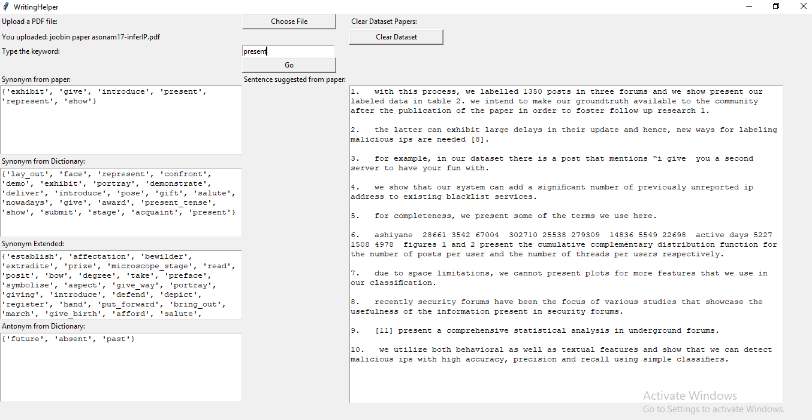

# WritingHelper
Suggest Matching Sentence from a Corpus based on given keywords

Purpose: This NLP based project was created to follow the writing style and word chosing capability of my PhD supervisor

Design features:
1. OOP in python
2. NLP and basic algebra

Application Features:
  1. Very interactive GUI
  2. Uploading the pdfs as dataset
  3. Converting the pdf to text
  4. Find ranked resutls from the dataset papers based on the given search keyword
  5. Search auto-complete and ranked  auto-suggesstion
  6. Further upload paper or clearing the dataset option
  
Prerequisite: Python 3+

Packages needed: 

